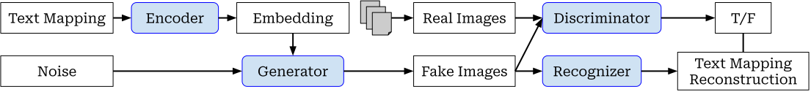

# ScribeSmith

## Abstract

The [report](docs/report/report.pdf) outlines an implementation of a **Generative Adversarial Network** that attempts to generate realistic-looking images of handwritten text from ASCII text input along with a **text Recognizer** model. We present architecture, training, data, and a discussion of our model's qualitative and quantitative results on different datasets. The IAM handwriting Database is processed for training and validation, while the model is tested on a set of randomly generated and handwritten Shakespeare text. We also prepare baseline models for the recognizer and generator to gauge our primary model's performance. We also utilize **Fréchet Inception Distance** and **Character Error Rate** metrics to evaluate different sub-networks within the GAN. The final result of the project is a Generator that does not perform as expected, and a successful Recognizer. Potential ethical considerations for this project are also addressed.

|  |
|:--:|
| *High-level overview of the ScribeSmith model* |

## Contributors

The group agrees that there were only slight differences in individual contribution proportions.

- Aniruddh Aragola ([Aniruddh00001](https://github.com/Aniruddh00001))
- Nabeth Ghazi ([nabethg](https://github.com/nabethg))
- Ran (Andy) Gong ([AG2048](https://github.com/AG2048))
- Zerui (Kevin) Wang ([Togohogo1](https://github.com/Togohogo1))

## Setup

The easiest way to set up this project locally is to use [conda](https://docs.conda.io/en/latest/). Verify that conda installed properly and added to `PATH` by checking `conda --version`.

To set up the conda environment, run:

```bash
conda env create -f environment.yml
conda activate aps360
```

## `data` File Structure

As stated above, our training data is from the IAM Handwriting Database, available [here](https://fki.tic.heia-fr.ch/databases/download-the-iam-handwriting-database). To ensure proper data loading without error:

- Download and unzip `data/ascii.tgz` and move only `lines.txt` into the `data/` folder
- Download and unzip `data/lines.tgz` into `data/lines/`

The end result should look something like this:

```diff
  ./
  ├── data/
  │   ├── chars/
  │   │   ├── 02/
  │   │   │   ⋮
  │   │   └── 72/
+ │   ├── lines/
+ │   │   ├── a01/
+ │   │   │   ⋮
+ │   │   └── r06/
  │   └── lines.txt
```

## `models` File Structure

To ensure the proper functionality of the Jupyter Notebook files, various subdirectories under `models/` must be created according to the file structure below (only directories shown):

```diff
  models/
+ ├── main_model/
+ │   ├── model_snapshots/
+ │   ├── model_training_information/
+ │   └── model_training_information_rawlist/
+ ├── recognizers/
  └── shakespeare_demo_handwritten/
```

## Acknowledgments

This project was part of the [APS360](https://engineering.calendar.utoronto.ca/course/aps360h1) course offered by the [University of Toronto Faculty of Applied Science and Engineering](https://www.engineering.utoronto.ca/).

The [report](docs/report) Latex template has been derived from the assignment guideline.
